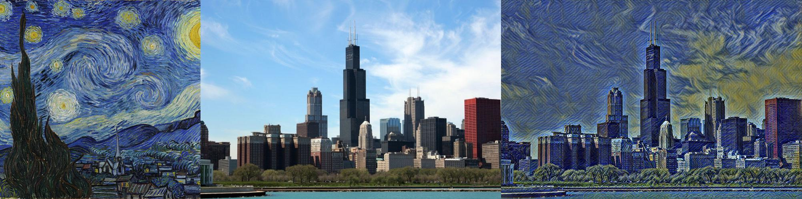

## 图片风格迁移
本项目主要参考 [风格迁移三部曲](https://zhuanlan.zhihu.com/p/40322927)。由衷的感谢原博主。

> 新添加了Model_server

## Install
建议新建一个环境，主要使用的包有：numpy, cv2, pillow, pytorch, torchvision, tqdm,flask

由于需要使用GPU，因此需要配置好CUDA环境，可以参考[Pytorch 安装](https://pytorch.org/get-started/locally/)


```bash
git clone https://github.com/csuhan/nerual_image_style_transform.git
cd nerual_image_style_transform
conda install numpy pillow pytorch torchvision cudatoolkit tqdm flask
pip install opencv-python
```

## Architecture

项目包含三个目录: exp1, exp2, exp3，分别为三种方法。每个目录下为单独的项目，包括：train.py, test.py, base_model.py(模型定义), utils.py(辅助函数).

exp1：[A Neural Algorithm of Artistic Style](http://arxiv.org/abs/1508.06576)

exp2: [Perceptual Losses for Real-Time Style Transfer and Super-Resolution](http://arxiv.org/abs/1603.08155)

exp3: [Meta Networks for Neural Style Transfer](http://arxiv.org/abs/1709.04111)

## Dataset
* [MS COCO](http://cocodataset.org/): 使用coco数据集的主要是为了使模型具有更好的泛化性，因此只需包含一些影像即可。即coco->train2017,val2017,test2017,annaotaions等。可以从[这篇文章](https://blog.csdn.net/daniaokuye/article/details/78699138)中提供的链接下载.
* [Wikiart](https://www.kaggle.com/c/painter-by-numbers/data):此数据集为kaggle整理的，可以在上面网站登录，下载train.zip（train.zip太大，可以下载train_1.zip），其目的是使模型对多种style都能适应。
* imgs: imgs文件夹有一些测试图像。风格图像:style.jpg,art_dataset; 输入图像:content.jpg, content1.jpg, content2.jpg

## Train && Test

### Exp1
由于[A Neural Algorithm of Artistic Style](http://arxiv.org/abs/1508.06576)介绍的方法直接对输入影像进行优化，因此仅需要一张输入影像和一张风格影像。

Train && Test:
```bash
cd exp1
python train.py your_input_image_path.jpg your_style_image_path.jpg -o output_image_path.jpg -s steps_for_training
```

### Exp2
[Perceptual Losses for Real-Time Style Transfer and Super-Resolution](http://arxiv.org/abs/1603.08155),此方法需要一个图像训练数据集（COCO），一张风格影像，实现任意输入，固定风格。



Train:
```bash
cd exp2
python train.py coco_dataset_path style_image_path
```
Test:
测试时首先加载预训练模型:transformnet.pth。此模型在coco数据集(16k images)上训练了一个epoch。
```bash
python test.py your_input_image.jpg -o output_image_path.jpg
```

### Exp3
[Meta Networks for Neural Style Transfer](http://arxiv.org/abs/1709.04111)，此方法可以实现任意输入，任意风格的转换，需要一个图像数据集（COCO），一个风格数据集（Wikiart）。

Train:
```bash
cd exp3
python train.py coco_dataset_path style_dataset_path
```
Test:
```bash
python test.py
```

## Model Server

基于exp2，本项目添加了一个简易的Model Server。

目录：Model_Server
结构:
* base_model.py 模型定义,与exp2中相同
* utils.py 辅助函数，与exp2中相同
* server.py 基于Flask的Web App，实现在线的style transfer
* models 训练好的模型，目前仅包括梵高的星空（Starry Night）
* uploads 图片上传目录
* outputs 图片输出目录

> 使用前请务必安装flask

启动:
```bash
cd model_server
env FLASK_APP=server.py flask run
```

路由：
1. 图片输入, ```/style```, Method: ```Post```, Input: ```Image```
2. 图片输出, ```/imgs/img_id.jpg```, Method: ```GET```

使用：其实model_server为exp2的模型提供了一个web接口。使用时只需要Post一张影像即可，转换之后，接口会跳转到输出影像的url。
如[demo.html](model_server/demo.html)所示：

```html
<!DOCTYPE html>
<html lang="en">
<head>
    <title>Style Transfer Demo</title>
</head>
<body>
    <form action="http://your_server_url/style" method="post" enctype="multipart/form-data">
    <input type="file" name="file" id="file">
    <input type="submit" value="submit">
</form>
</body>
</html>
```
